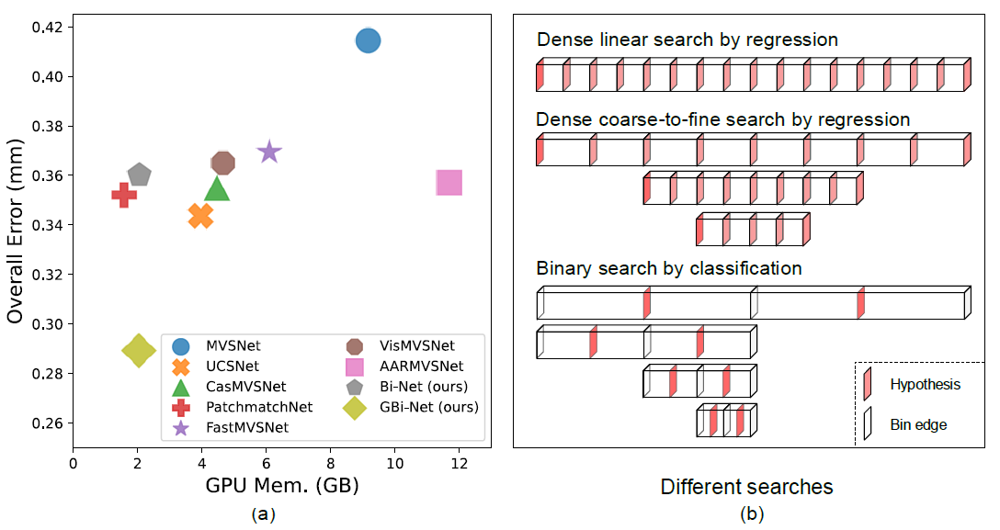

<!-- <br />
<div align="center">
  <h1 align="center">Generalized Binary Search Network for Highly-Efficient Multi-View Stereo</h1>

  <p align="center">
    <a href="https://mizhenxing.github.io">Zhenxing Mi</a>,
    <a href="https://boese0601.github.io">Di Chang</a>,
    <a href="https://www.danxurgb.net">Dan Xu</a>
    <br />
    The Hong Kong University of Science and Technology
    <br />
    <strong>CVPR 2022</strong>
    <br />
    <a href="https://arxiv.org/abs/2112.02338">Arxiv</a> | <a href="https://mizhenxing.github.io/gbinet">Project page</a>
    <br />
  </p>
</div> -->


# Generalized Binary Search Network for Highly-Efficient Multi-View Stereo

### [Arxiv](https://arxiv.org/abs/2112.02338) | [Project Page](https://mizhenxing.github.io/gbinet)

## Introduction

This is the official pytorch implementation of our CVPR2022 paper: Generalized Binary Search Network for Highly-Efficient Multi-View Stereo. In this work, we propose a novel method for highly efficient MVS that remarkably decreases the memory footprint, meanwhile clearly advancing state-of-the-art depth prediction performance. We investigate what a search strategy can be reasonably optimal for MVS taking into account of both efficiency and effectiveness. We first formulate MVS as a binary search problem, and accordingly propose a generalized binary search network for MVS. Specifically, in each step, the depth range is split into 2 bins with extra 1 error tolerance bin on both sides. A classification is performed to identify which bin contains the true depth. We also design three mechanisms to respectively handle classification errors, deal with out-of-range samples and decrease the training memory. The new formulation makes our method only sample a very small number of depth hypotheses in each step, which is highly memory efficient, and also greatly facilitates quick training convergence.



## Installation

Clone repo:
```
git clone https://github.com/MiZhenxing/GBi-Net.git
cd GBi-Net
```

The code is tested with Python == 3.6, PyTorch == 1.9.0 and CUDA == 11.1 on NVIDIA GeForce RTX 3090. We recommend you to use [anaconda](https://www.anaconda.com/) to manage dependencies. You may need to change the torch and cuda version in the `requirements.txt` according to your computer.
```
conda create -n gbinet python=3.6
conda activate gbinet
pip install -r requirements.txt
```

## Datasets

### DTU

Download the [DTU dataset](https://drive.google.com/file/d/1eDjh-_bxKKnEuz5h-HXS7EDJn59clx6V/view) pre-processed by [MVSNet](https://github.com/YoYo000/MVSNet) and extract the archive. You could use [gdown](https://github.com/wkentaro/gdown) to download it form Google Drive. You could refer to [MVSNet](https://github.com/YoYo000/MVSNet) for the detailed documents of the file formats.

Download the original resolution [depth maps](https://drive.google.com/open?id=1LVy8tsWajG3uPTCYPSxDvVXFCdIYXaS-) provided by [YaoYao](https://github.com/YoYo000/MVSNet/issues/106). Extract it and rename the folder to `Depths_raw`. 

Download the original resolution `Rectified` [images](http://roboimagedata2.compute.dtu.dk/data/MVS/Rectified.zip) from the [DTU website](https://roboimagedata.compute.dtu.dk/?page_id=36). Extract it and rename the folder to `Rectified_raw`. 

Merge the three folders together and you should get a dataset folder like below:

```
dtu
├── Cameras
├── Depths
├── Depths_raw
├── Rectified
└── Rectified_raw
```

### BlendedMVS

Download the [low-res set](https://1drv.ms/u/s!Ag8Dbz2Aqc81gVDgxb8MDGgoV74S?e=hJKlvV) from [BlendedMVS](https://github.com/YoYo000/BlendedMVS). Extract the file and you should get a data folder like below:

```
BlendedMVS
└── low_res
```

### Tanksandtemples

Download the [Tanks and Temples testing set](https://drive.google.com/open?id=1YArOJaX9WVLJh4757uE8AEREYkgszrCo) pre-processed by [MVSNet](https://github.com/YoYo000/MVSNet). For the `intermediate` subset, remember to replace the cameras by those in `short_range_caemeras_for_mvsnet.zip` in the `intermediate` folder, see [here](https://github.com/YoYo000/MVSNet/issues/14). You should get a dataset folder like below:

```
tankandtemples
├── advanced
│   ├── Auditorium
│   ├── Ballroom
│   ├── Courtroom
│   ├── Museum
│   ├── Palace
│   └── Temple
└── intermediate
    ├── Family
    ├── Francis
    ├── Horse
    ├── Lighthouse
    ├── M60
    ├── Panther
    ├── Playground
    └── Train
```

## Configure

We use [yaml](https://yaml.org/) file to set options in our codes. Several key options are explained below. Other options are self-explanatory in the codes. Before running our codes, you may need to change the `true_gpu`, `data: root_dir` and `model_path` (only for testing).

* `output_dir` A relative or absolute folder path for writing logs, depthmaps.
* `true_gpu` The true GPU IDs, used for setting CUDA_VISIBLE_DEVICES in the code. You may change it to your GPU IDs.
* `gpu` The GPU ID used in your experiment. If true_gpu: "5, 6". Then you could use gpu: [0], gpu: [1], or gpu: [0, 1]
* `max_depth` Max depth of the binary tree in the code, same as the `stage` number described in our paper. For historical reasons, the `stage` number in the code means the number of 3D networks.
* `model_path` The checkpoint file path used for testing.
* `stage_num` The number of 3D networks.
* `depth2stage` The correspondence between iterations and 3D networks.
* `data: root_dir` A relative or absolute folder path for training or testing data. In order to successfully run the codes, you may need to change it to your data folder.
* `fusion: output_dir` A relative or absolute folder path for writing point clouds.

## Training

Train the model on DTU dataset with random crop augmentation
```
python train_gbinet.py --cfg configs/train_dtu_crop.yaml
```

Train the model on DTU dataset without random crop augmentation
```
python train_gbinet.py --cfg configs/train_dtu.yaml
```

Train the model on BlendedMVS dataset
```
python train_gbinet.py --cfg configs/train_blended.yaml
```

## Testing

We have provided several checkpoints in the `checkpoints` folder. You could use `test_gbinet.py` to reconstruct depthmaps and point clouds with these checkpoints. To reproduce the DTU results in our paper, run commands below:

```
python test_gbinet.py --cfg configs/test_dtu_crop.yaml
```
```
python test_gbinet.py --cfg configs/test_dtu.yaml
```
After you get the point clouds, you could follow the instructions in [DTU](http://roboimagedata.compute.dtu.dk/?page_id=36) website and also the [PatchmatchNet](https://github.com/FangjinhuaWang/PatchmatchNet) to quantitatively evaluate the point clouds.

To reproduce the Tanksandtemples results in our paper, run commands below:
```
python test_gbinet.py --cfg configs/test_tanks_intermediate.yaml
```
```
python test_gbinet.py --cfg configs/test_tanks_advanced.yaml
```
After you get the point clouds, you could submit them to the [Tanksandtemples](https://www.tanksandtemples.org/) website for quantitative evaluatation.

<!-- LICENSE -->
## License

Our code is distributed under the MIT License. See `LICENSE` file for more information.

## Citation

```bibtex
@inproceedings{mi2022generalized,
      title={Generalized Binary Search Network for Highly-Efficient Multi-View Stereo}, 
      author={Zhenxing Mi and Chang Di and Dan Xu},
      booktitle={Proceedings of the IEEE/CVF Conference on Computer Vision and Pattern Recognition},
      year={2022}
}
```

## Contact

If you have any questions, please raise an issue or email to Zhenxing Mi (`zmiaa@connect.ust.hk`).

## Acknowledgments

Our code follows several awesome repositories. We appreciate them for making their codes available to public.

* [MVSNet](https://github.com/YoYo000/MVSNet)
* [MVSNet_pytorch](https://github.com/xy-guo/MVSNet_pytorch)
* [PointMVSNet](https://github.com/callmeray/PointMVSNet)
* [UCSNet](https://github.com/touristCheng/UCSNet)
* [CasMVSNet](https://github.com/alibaba/cascade-stereo/tree/master/CasMVSNet)
* [CasMVSNet_pl](https://github.com/kwea123/CasMVSNet_pl)
* [PatchmatchNet](https://github.com/FangjinhuaWang/PatchmatchNet)
